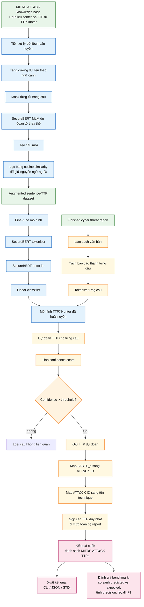

# Workflow tổng quát của TTPXHunter

Tài liệu này vẽ lại workflow tổng quát của TTPXHunter dựa trên paper
["TTPXHunter: Actionable Threat Intelligence Extraction as TTPs from Finished Cyber Threat Reports"](https://arxiv.org/html/2403.03267v3)
và source code reproduce trong repo này.

Ý chính: TTPXHunter chuyển báo cáo threat intelligence dạng văn bản tự do thành
danh sách kỹ thuật MITRE ATT&CK bằng cách tách báo cáo thành câu, phân loại từng
câu bằng mô hình transformer chuyên biệt cho an ninh mạng, lọc các dự đoán thiếu
tin cậy, rồi gom kết quả ở mức toàn bộ báo cáo.

## Diễn giải ngắn

| Giai đoạn | Vai trò |
| --- | --- |
| Dữ liệu nền | Lấy tri thức từ MITRE ATT&CK và dữ liệu sentence-TTP của TTPHunter. |
| Tăng cường dữ liệu | Dùng SecureBERT dạng Masked Language Model để tạo thêm câu cho các lớp TTP ít dữ liệu, sau đó lọc bằng cosine similarity để tránh lệch nghĩa. |
| Huấn luyện | Fine-tune SecureBERT kết hợp linear classifier để ánh xạ một câu sang một lớp TTP. |
| Suy luận | Nhận threat report, làm sạch văn bản, tách câu, tokenize, rồi đưa từng câu qua mô hình. |
| Lọc câu liên quan | Chỉ giữ dự đoán có confidence vượt threshold, giúp loại các câu không mô tả hành vi tấn công. |
| Gom kết quả | Chuyển nhãn mô hình sang ATT&CK ID, map sang tên technique, loại trùng và trả về danh sách TTP của toàn bộ báo cáo. |
| Đánh giá | Với benchmark như CISA, so sánh TTP dự đoán với nhãn kỳ vọng để tính precision, recall và F1. |

## Note

- Dùng model đã huấn luyện sẵn `nanda-rani/TTPXHunter`;
- Tách câu bằng NLTK
- Lọc dự đoán bằng threshold `0.644`;
- Map `LABEL_n` sang MITRE ATT&CK ID bằng `model_artifacts/label_dict.pkl`;
- Map ATT&CK ID sang tên technique bằng `model_artifacts/ttp_id_name.pkl`;
- Xuất kết quả qua CLI/JSON và có thêm workflow benchmark trên CISA.