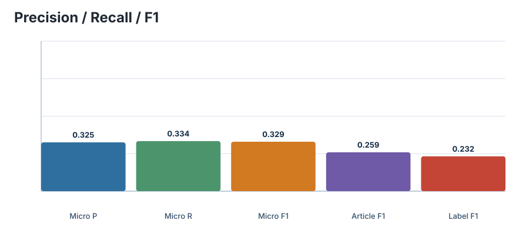
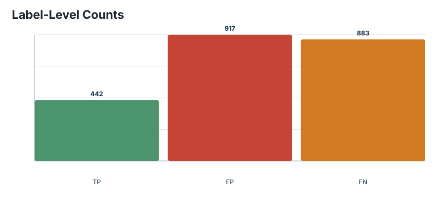
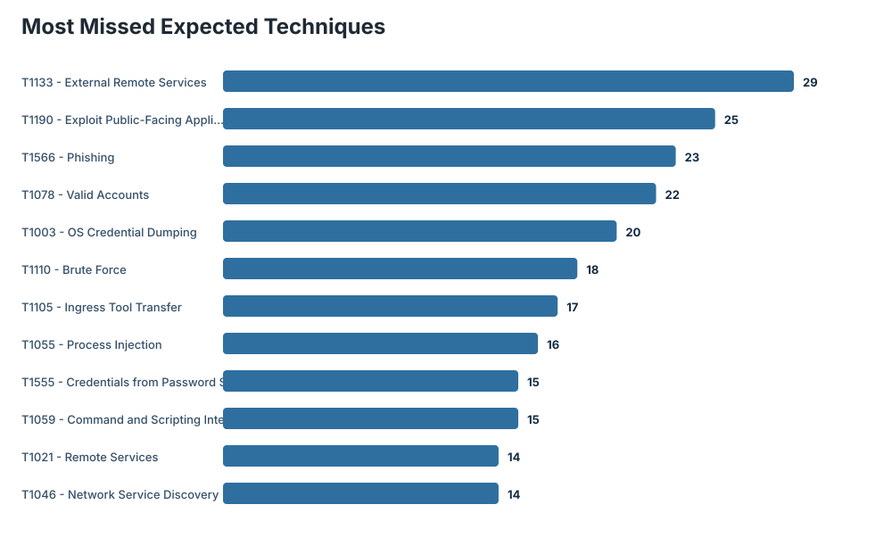
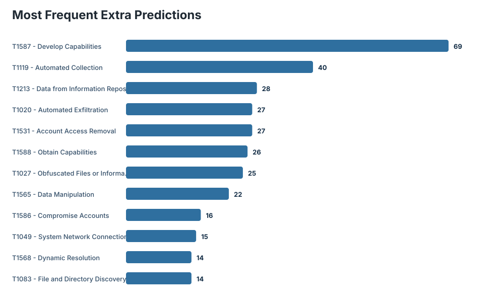
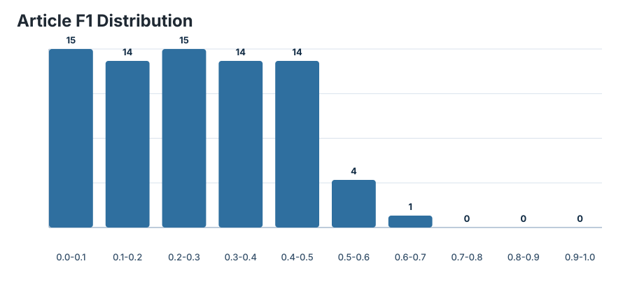

# CISA TTPXHunter Benchmark Report

## Run Configuration

| Field | Value |
| --- | --- |
| Dataset | `datasets/cisa/CISA-crawl-rt-ttp-ct.json` |
| Zenodo record | `14659512` |
| DOI | `10.5281/zenodo.14659512` |
| Articles evaluated | 77 / 77 |
| Text field | `clean` |
| Expected mode | `model-label-space` |
| Preprocess | `paper-ioc` |
| Section filter | `cisa-attack-narrative` |
| Model | `nanda-rani/TTPXHunter` |
| Revision | `not pinned` |
| Threshold | 0.644 |
| Top-k | none |
| Device | `cpu` |
| Batch size | 16 |

## Aggregate Metrics

| Metric | Value |
| --- | ---: |
| Expected labels | 1325 |
| Predicted labels | 1359 |
| True positives | 442 |
| False positives | 917 |
| False negatives | 883 |
| Micro precision | 0.325239 |
| Micro recall | 0.333585 |
| Micro F1 | 0.329359 |
| Article macro precision | 0.272499 |
| Article macro recall | 0.292967 |
| Article macro F1 | 0.258722 |
| Label macro precision | 0.286049 |
| Label macro recall | 0.261902 |
| Label macro F1 | 0.231827 |
| Hamming loss | 0.121122 |

## Charts

### Metrics overview

### TP / FP / FN counts

### Most missed expected techniques

### Most frequent extra predictions

### Article F1 distribution

## Article Quality

| Metric | Value |
| --- | ---: |
| Exact-match articles | 0 |
| Articles with no expected labels | 4 |
| Articles with no predictions | 0 |
| Mean expected labels/article | 17.208 |
| Median expected labels/article | 13.000 |
| Mean predicted labels/article | 17.649 |
| Median predicted labels/article | 14.000 |
| Mean sentences/article | 88.610 |
| Median sentences/article | 59.000 |

## Top Gaps

### Most Missed Expected Techniques

| Rank | Technique | Name | Count |
| ---: | --- | --- | ---: |
| 1 | `T1133` | External Remote Services | 29 |
| 2 | `T1190` | Exploit Public-Facing Application | 25 |
| 3 | `T1566` | Phishing | 23 |
| 4 | `T1078` | Valid Accounts | 22 |
| 5 | `T1003` | OS Credential Dumping | 20 |
| 6 | `T1110` | Brute Force | 18 |
| 7 | `T1105` | Ingress Tool Transfer | 17 |
| 8 | `T1055` | Process Injection | 16 |
| 9 | `T1555` | Credentials from Password Stores | 15 |
| 10 | `T1059` | Command and Scripting Interpreter | 15 |
| 11 | `T1021` | Remote Services | 14 |
| 12 | `T1046` | Network Service Discovery | 14 |
| 13 | `T1552` | Unsecured Credentials | 14 |
| 14 | `T1016` | System Network Configuration Discovery | 14 |
| 15 | `T1560` | Archive Collected Data | 14 |

### Most Frequent Extra Predictions

| Rank | Technique | Name | Count |
| ---: | --- | --- | ---: |
| 1 | `T1587` | Develop Capabilities | 69 |
| 2 | `T1119` | Automated Collection | 40 |
| 3 | `T1213` | Data from Information Repositories | 28 |
| 4 | `T1020` | Automated Exfiltration | 27 |
| 5 | `T1531` | Account Access Removal | 27 |
| 6 | `T1588` | Obtain Capabilities | 26 |
| 7 | `T1027` | Obfuscated Files or Information | 25 |
| 8 | `T1565` | Data Manipulation | 22 |
| 9 | `T1586` | Compromise Accounts | 16 |
| 10 | `T1049` | System Network Connections Discovery | 15 |
| 11 | `T1568` | Dynamic Resolution | 14 |
| 12 | `T1083` | File and Directory Discovery | 14 |
| 13 | `T1583` | Acquire Infrastructure | 14 |
| 14 | `T1036` | Masquerading | 14 |
| 15 | `T1482` | Domain Trust Discovery | 13 |

### Most Frequent Matches

| Rank | Technique | Name | Count |
| ---: | --- | --- | ---: |
| 1 | `T1059` | Command and Scripting Interpreter | 26 |
| 2 | `T1070` | Indicator Removal on Host | 16 |
| 3 | `T1083` | File and Directory Discovery | 15 |
| 4 | `T1078` | Valid Accounts | 15 |
| 5 | `T1190` | Exploit Public-Facing Application | 15 |
| 6 | `T1090` | Proxy | 13 |
| 7 | `T1027` | Obfuscated Files or Information | 12 |
| 8 | `T1021` | Remote Services | 10 |
| 9 | `T1036` | Masquerading | 10 |
| 10 | `T1486` | Data Encrypted for Impact | 10 |
| 11 | `T1003` | OS Credential Dumping | 9 |
| 12 | `T1071` | Application Layer Protocol | 9 |
| 13 | `T1053` | Scheduled Task/Job | 9 |
| 14 | `T1087` | Account Discovery | 8 |
| 15 | `T1018` | Remote System Discovery | 8 |

## Article-Level Extremes

### Best Articles

| Rank | Index | F1 | Precision | Recall | TP | FP | FN | Expected | Predicted | URL |
| ---: | ---: | ---: | ---: | ---: | ---: | ---: | ---: | ---: | ---: | --- |
| 1 | 69 | 0.682927 | 0.918033 | 0.543689 | 56 | 5 | 47 | 103 | 61 | [open](https://www.cisa.gov/news-events/cybersecurity-advisories/aa20-336a) |
| 2 | 48 | 0.555556 | 0.434783 | 0.769231 | 10 | 13 | 3 | 13 | 23 | [open](https://www.cisa.gov/news-events/cybersecurity-advisories/aa22-138b) |
| 3 | 67 | 0.530612 | 0.393939 | 0.812500 | 13 | 20 | 3 | 16 | 33 | [open](https://www.cisa.gov/news-events/cybersecurity-advisories/aa21-048a) |
| 4 | 14 | 0.523810 | 0.478261 | 0.578947 | 11 | 12 | 8 | 19 | 23 | [open](https://www.cisa.gov/news-events/cybersecurity-advisories/aa23-319a) |
| 5 | 3 | 0.500000 | 0.520833 | 0.480769 | 25 | 23 | 27 | 52 | 48 | [open](https://www.cisa.gov/news-events/cybersecurity-advisories/aa24-038a) |
| 6 | 71 | 0.485714 | 0.369565 | 0.708333 | 17 | 29 | 7 | 24 | 46 | [open](https://www.cisa.gov/news-events/cybersecurity-advisories/aa20-301a) |
| 7 | 27 | 0.472727 | 0.481481 | 0.464286 | 13 | 14 | 15 | 28 | 27 | [open](https://www.cisa.gov/news-events/cybersecurity-advisories/aa23-136a) |
| 8 | 76 | 0.470588 | 0.363636 | 0.666667 | 4 | 7 | 2 | 6 | 11 | [open](https://www.cisa.gov/news-events/cybersecurity-advisories/aa20-183a) |
| 9 | 0 | 0.464286 | 0.619048 | 0.371429 | 13 | 8 | 22 | 35 | 21 | [open](https://www.cisa.gov/news-events/cybersecurity-advisories/aa24-060a) |
| 10 | 9 | 0.454545 | 0.416667 | 0.500000 | 5 | 7 | 5 | 10 | 12 | [open](https://www.cisa.gov/news-events/cybersecurity-advisories/aa23-341a) |
| 11 | 22 | 0.448276 | 0.433333 | 0.464286 | 13 | 17 | 15 | 28 | 30 | [open](https://www.cisa.gov/news-events/cybersecurity-advisories/aa23-201a) |
| 12 | 10 | 0.444444 | 0.444444 | 0.444444 | 8 | 10 | 10 | 18 | 18 | [open](https://www.cisa.gov/news-events/cybersecurity-advisories/aa23-339a) |
| 13 | 28 | 0.439024 | 0.428571 | 0.450000 | 18 | 24 | 22 | 40 | 42 | [open](https://www.cisa.gov/news-events/cybersecurity-advisories/aa23-129a) |
| 14 | 8 | 0.437500 | 0.411765 | 0.466667 | 14 | 20 | 16 | 30 | 34 | [open](https://www.cisa.gov/news-events/cybersecurity-advisories/aa23-347a) |
| 15 | 33 | 0.435897 | 0.459459 | 0.414634 | 17 | 20 | 24 | 41 | 37 | [open](https://www.cisa.gov/news-events/cybersecurity-advisories/aa23-059a) |

### Worst Articles

| Rank | Index | F1 | Precision | Recall | TP | FP | FN | Expected | Predicted | URL |
| ---: | ---: | ---: | ---: | ---: | ---: | ---: | ---: | ---: | ---: | --- |
| 1 | 72 | 0.000000 | 0.000000 | 0.000000 | 0 | 7 | 5 | 5 | 7 | [open](https://www.cisa.gov/news-events/cybersecurity-advisories/aa20-296a) |
| 2 | 64 | 0.000000 | 0.000000 | 0.000000 | 0 | 5 | 4 | 4 | 5 | [open](https://www.cisa.gov/news-events/cybersecurity-advisories/aa21-148a) |
| 3 | 29 | 0.000000 | 0.000000 | 0.000000 | 0 | 14 | 3 | 3 | 14 | [open](https://www.cisa.gov/news-events/cybersecurity-advisories/aa23-108) |
| 4 | 60 | 0.000000 | 0.000000 | 0.000000 | 0 | 9 | 2 | 2 | 9 | [open](https://www.cisa.gov/news-events/cybersecurity-advisories/aa21-287a) |
| 5 | 68 | 0.000000 | 0.000000 | 0.000000 | 0 | 3 | 2 | 2 | 3 | [open](https://www.cisa.gov/news-events/cybersecurity-advisories/aa21-008a) |
| 6 | 11 | 0.000000 | 0.000000 | 0.000000 | 0 | 7 | 1 | 1 | 7 | [open](https://www.cisa.gov/news-events/cybersecurity-advisories/aa23-335a) |
| 7 | 63 | 0.080000 | 0.222222 | 0.048780 | 2 | 7 | 39 | 41 | 9 | [open](https://www.cisa.gov/news-events/cybersecurity-advisories/aa21-200b) |
| 8 | 62 | 0.083333 | 0.250000 | 0.050000 | 1 | 3 | 19 | 20 | 4 | [open](https://www.cisa.gov/news-events/cybersecurity-advisories/aa21-200a) |
| 9 | 57 | 0.086957 | 0.111111 | 0.071429 | 1 | 8 | 13 | 14 | 9 | [open](https://www.cisa.gov/news-events/cybersecurity-advisories/aa22-011a) |
| 10 | 34 | 0.090909 | 0.066667 | 0.142857 | 1 | 14 | 6 | 7 | 15 | [open](https://www.cisa.gov/news-events/cybersecurity-advisories/aa23-040a) |
| 11 | 13 | 0.097561 | 0.166667 | 0.068966 | 2 | 10 | 27 | 29 | 12 | [open](https://www.cisa.gov/news-events/cybersecurity-advisories/aa23-320a) |
| 12 | 15 | 0.111111 | 0.083333 | 0.166667 | 1 | 11 | 5 | 6 | 12 | [open](https://www.cisa.gov/news-events/cybersecurity-advisories/aa23-284a) |
| 13 | 43 | 0.111111 | 0.083333 | 0.166667 | 1 | 11 | 5 | 6 | 12 | [open](https://www.cisa.gov/news-events/cybersecurity-advisories/aa22-223a) |
| 14 | 51 | 0.122449 | 0.200000 | 0.088235 | 3 | 12 | 31 | 34 | 15 | [open](https://www.cisa.gov/news-events/cybersecurity-advisories/aa22-083a) |
| 15 | 17 | 0.133333 | 0.111111 | 0.166667 | 2 | 16 | 10 | 12 | 18 | [open](https://www.cisa.gov/news-events/cybersecurity-advisories/aa23-270a) |

## Output Artifacts

| Artifact | Path |
| --- | --- |
| json | `results/cisa/cisa_benchmark_full_ioc_filtered.json` |
| markdown_report | `results/cisa/cisa_benchmark_full_ioc_filtered_report.md` |
| rows_csv | `results/cisa/cisa_benchmark_full_ioc_filtered_rows.csv` |
| chart_metrics | `charts_ioc_filtered/metrics_overview.svg` |
| chart_confusion | `charts_ioc_filtered/confusion_counts.svg` |
| chart_top_missing | `charts_ioc_filtered/top_missing.svg` |
| chart_top_extra | `charts_ioc_filtered/top_extra.svg` |
| chart_f1_distribution | `charts_ioc_filtered/article_f1_distribution.svg` |

## Interpretation Notes

- The default benchmark compares base MITRE ATT&CK techniques only.
- CISA tactics are dropped, sub-techniques are collapsed to parent techniques, and invalid regex matches are ignored.
- `expected_mode=model-label-space` filters expected labels to techniques the TTPXHunter classifier can emit.
- High false positives indicate the threshold may need tuning for CISA advisories, which are longer and more operational than the SharpPanda sample.
