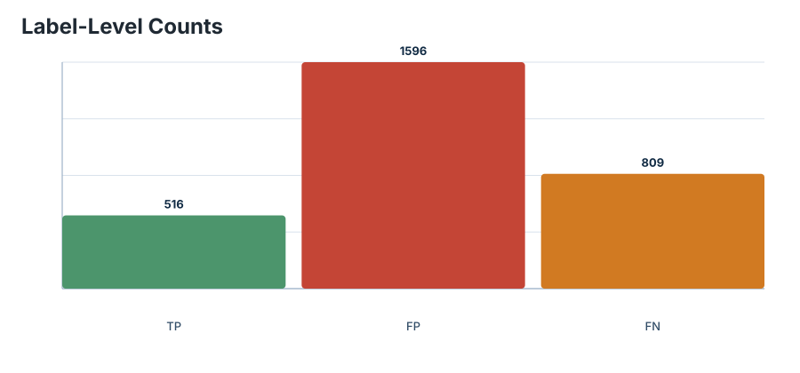
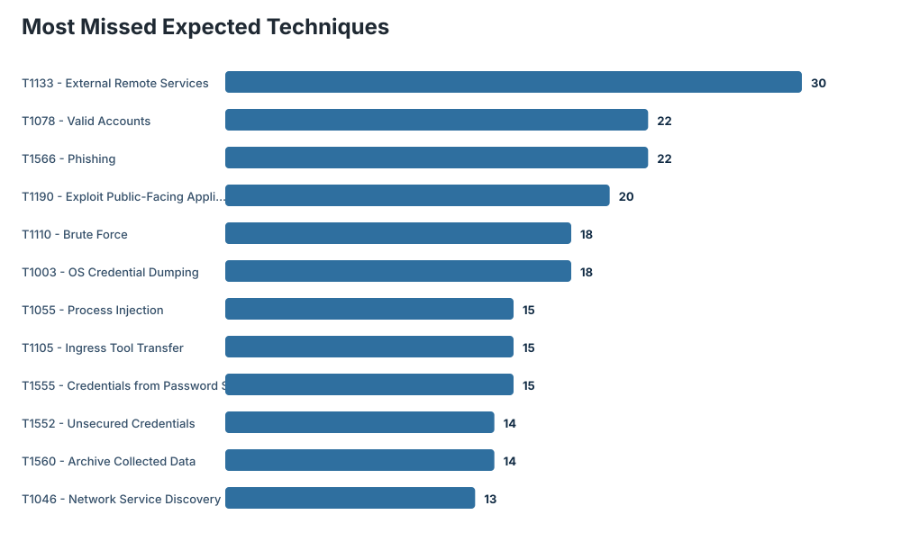
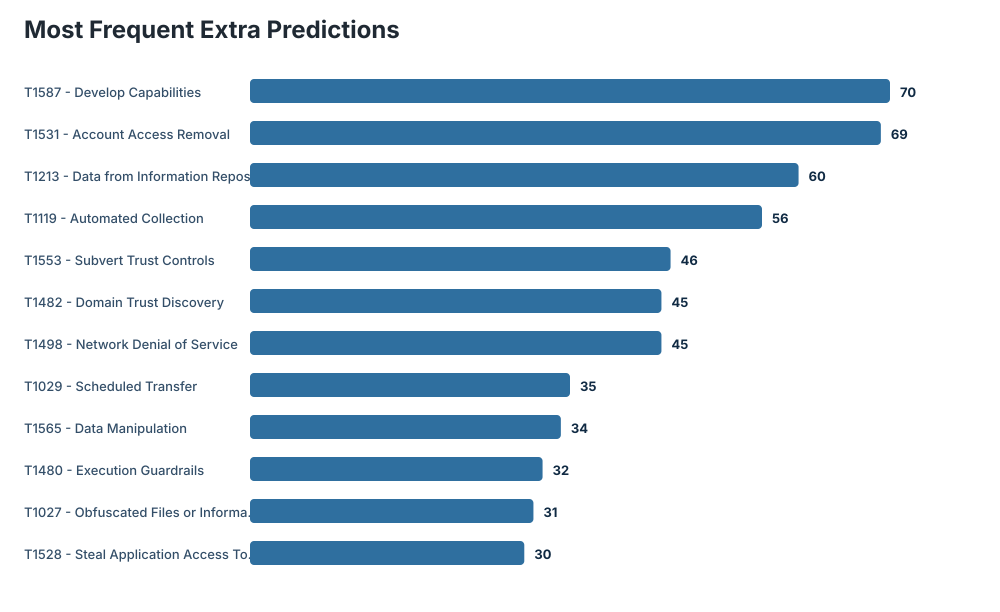
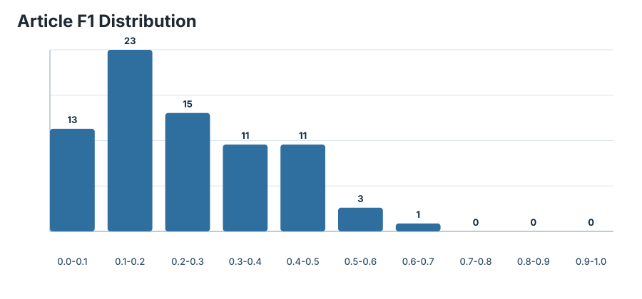

# CISA TTPXHunter Benchmark Report

## Run Configuration

| Field | Value |
| --- | --- |
| Dataset | `datasets/cisa/CISA-crawl-rt-ttp-ct.json` |
| Zenodo record | `14659512` |
| DOI | `10.5281/zenodo.14659512` |
| Articles evaluated | 77 / 77 |
| Text field | `clean` |
| Expected mode | `model-label-space` |
| Model | `nanda-rani/TTPXHunter` |
| Revision | `not pinned` |
| Threshold | 0.644 |
| Device | `mps` |
| Batch size | 32 |

## Aggregate Metrics

| Metric | Value |
| --- | ---: |
| Expected labels | 1325 |
| Predicted labels | 2112 |
| True positives | 516 |
| False positives | 1596 |
| False negatives | 809 |
| Micro precision | 0.244318 |
| Micro recall | 0.389434 |
| Micro F1 | 0.300262 |
| Macro precision | 0.210597 |
| Macro recall | 0.342080 |
| Macro F1 | 0.242000 |

## Charts

### Metrics overview

### TP / FP / FN counts

### Most missed expected techniques

### Most frequent extra predictions

### Article F1 distribution

## Article Quality

| Metric | Value |
| --- | ---: |
| Exact-match articles | 0 |
| Articles with no expected labels | 4 |
| Articles with no predictions | 0 |
| Mean expected labels/article | 17.208 |
| Median expected labels/article | 13.000 |
| Mean predicted labels/article | 27.429 |
| Median predicted labels/article | 24.000 |
| Mean sentences/article | 190.026 |
| Median sentences/article | 165.000 |

## Top Gaps

### Most Missed Expected Techniques

| Rank | Technique | Name | Count |
| ---: | --- | --- | ---: |
| 1 | `T1133` | External Remote Services | 30 |
| 2 | `T1078` | Valid Accounts | 22 |
| 3 | `T1566` | Phishing | 22 |
| 4 | `T1190` | Exploit Public-Facing Application | 20 |
| 5 | `T1110` | Brute Force | 18 |
| 6 | `T1003` | OS Credential Dumping | 18 |
| 7 | `T1055` | Process Injection | 15 |
| 8 | `T1105` | Ingress Tool Transfer | 15 |
| 9 | `T1555` | Credentials from Password Stores | 15 |
| 10 | `T1552` | Unsecured Credentials | 14 |
| 11 | `T1560` | Archive Collected Data | 14 |
| 12 | `T1046` | Network Service Discovery | 13 |
| 13 | `T1016` | System Network Configuration Discovery | 13 |
| 14 | `T1486` | Data Encrypted for Impact | 12 |
| 15 | `T1071` | Application Layer Protocol | 12 |

### Most Frequent Extra Predictions

| Rank | Technique | Name | Count |
| ---: | --- | --- | ---: |
| 1 | `T1587` | Develop Capabilities | 70 |
| 2 | `T1531` | Account Access Removal | 69 |
| 3 | `T1213` | Data from Information Repositories | 60 |
| 4 | `T1119` | Automated Collection | 56 |
| 5 | `T1553` | Subvert Trust Controls | 46 |
| 6 | `T1482` | Domain Trust Discovery | 45 |
| 7 | `T1498` | Network Denial of Service | 45 |
| 8 | `T1029` | Scheduled Transfer | 35 |
| 9 | `T1565` | Data Manipulation | 34 |
| 10 | `T1480` | Execution Guardrails | 32 |
| 11 | `T1027` | Obfuscated Files or Information | 31 |
| 12 | `T1528` | Steal Application Access Token | 30 |
| 13 | `T1049` | System Network Connections Discovery | 30 |
| 14 | `T1588` | Obtain Capabilities | 29 |
| 15 | `T1020` | Automated Exfiltration | 28 |

### Most Frequent Matches

| Rank | Technique | Name | Count |
| ---: | --- | --- | ---: |
| 1 | `T1059` | Command and Scripting Interpreter | 30 |
| 2 | `T1190` | Exploit Public-Facing Application | 20 |
| 3 | `T1027` | Obfuscated Files or Information | 15 |
| 4 | `T1078` | Valid Accounts | 15 |
| 5 | `T1070` | Indicator Removal on Host | 15 |
| 6 | `T1083` | File and Directory Discovery | 14 |
| 7 | `T1021` | Remote Services | 14 |
| 8 | `T1090` | Proxy | 13 |
| 9 | `T1003` | OS Credential Dumping | 11 |
| 10 | `T1071` | Application Layer Protocol | 11 |
| 11 | `T1486` | Data Encrypted for Impact | 11 |
| 12 | `T1053` | Scheduled Task/Job | 11 |
| 13 | `T1036` | Masquerading | 10 |
| 14 | `T1018` | Remote System Discovery | 10 |
| 15 | `T1087` | Account Discovery | 9 |

## Article-Level Extremes

### Best Articles

| Rank | Index | F1 | Precision | Recall | TP | FP | FN | Expected | Predicted | URL |
| ---: | ---: | ---: | ---: | ---: | ---: | ---: | ---: | ---: | ---: | --- |
| 1 | 69 | 0.682353 | 0.865672 | 0.563107 | 58 | 9 | 45 | 103 | 67 | [open](https://www.cisa.gov/news-events/cybersecurity-advisories/aa20-336a) |
| 2 | 67 | 0.509804 | 0.371429 | 0.812500 | 13 | 22 | 3 | 16 | 35 | [open](https://www.cisa.gov/news-events/cybersecurity-advisories/aa21-048a) |
| 3 | 53 | 0.506024 | 0.538462 | 0.477273 | 21 | 18 | 23 | 44 | 39 | [open](https://www.cisa.gov/news-events/cybersecurity-advisories/aa22-055a) |
| 4 | 22 | 0.500000 | 0.409091 | 0.642857 | 18 | 26 | 10 | 28 | 44 | [open](https://www.cisa.gov/news-events/cybersecurity-advisories/aa23-201a) |
| 5 | 14 | 0.480000 | 0.387097 | 0.631579 | 12 | 19 | 7 | 19 | 31 | [open](https://www.cisa.gov/news-events/cybersecurity-advisories/aa23-319a) |
| 6 | 71 | 0.478873 | 0.361702 | 0.708333 | 17 | 30 | 7 | 24 | 47 | [open](https://www.cisa.gov/news-events/cybersecurity-advisories/aa20-301a) |
| 7 | 3 | 0.465517 | 0.421875 | 0.519231 | 27 | 37 | 25 | 52 | 64 | [open](https://www.cisa.gov/news-events/cybersecurity-advisories/aa24-038a) |
| 8 | 9 | 0.461538 | 0.375000 | 0.600000 | 6 | 10 | 4 | 10 | 16 | [open](https://www.cisa.gov/news-events/cybersecurity-advisories/aa23-341a) |
| 9 | 0 | 0.457143 | 0.457143 | 0.457143 | 16 | 19 | 19 | 35 | 35 | [open](https://www.cisa.gov/news-events/cybersecurity-advisories/aa24-060a) |
| 10 | 27 | 0.451613 | 0.411765 | 0.500000 | 14 | 20 | 14 | 28 | 34 | [open](https://www.cisa.gov/news-events/cybersecurity-advisories/aa23-136a) |
| 11 | 33 | 0.450000 | 0.461538 | 0.439024 | 18 | 21 | 23 | 41 | 39 | [open](https://www.cisa.gov/news-events/cybersecurity-advisories/aa23-059a) |
| 12 | 48 | 0.448980 | 0.305556 | 0.846154 | 11 | 25 | 2 | 13 | 36 | [open](https://www.cisa.gov/news-events/cybersecurity-advisories/aa22-138b) |
| 13 | 28 | 0.444444 | 0.400000 | 0.500000 | 20 | 30 | 20 | 40 | 50 | [open](https://www.cisa.gov/news-events/cybersecurity-advisories/aa23-129a) |
| 14 | 76 | 0.421053 | 0.307692 | 0.666667 | 4 | 9 | 2 | 6 | 13 | [open](https://www.cisa.gov/news-events/cybersecurity-advisories/aa20-183a) |
| 15 | 19 | 0.406250 | 0.406250 | 0.406250 | 13 | 19 | 19 | 32 | 32 | [open](https://www.cisa.gov/news-events/cybersecurity-advisories/aa23-250a) |

### Worst Articles

| Rank | Index | F1 | Precision | Recall | TP | FP | FN | Expected | Predicted | URL |
| ---: | ---: | ---: | ---: | ---: | ---: | ---: | ---: | ---: | ---: | --- |
| 1 | 72 | 0.000000 | 0.000000 | 0.000000 | 0 | 19 | 5 | 5 | 19 | [open](https://www.cisa.gov/news-events/cybersecurity-advisories/aa20-296a) |
| 2 | 64 | 0.000000 | 0.000000 | 0.000000 | 0 | 21 | 4 | 4 | 21 | [open](https://www.cisa.gov/news-events/cybersecurity-advisories/aa21-148a) |
| 3 | 29 | 0.000000 | 0.000000 | 0.000000 | 0 | 22 | 3 | 3 | 22 | [open](https://www.cisa.gov/news-events/cybersecurity-advisories/aa23-108) |
| 4 | 60 | 0.000000 | 0.000000 | 0.000000 | 0 | 19 | 2 | 2 | 19 | [open](https://www.cisa.gov/news-events/cybersecurity-advisories/aa21-287a) |
| 5 | 68 | 0.000000 | 0.000000 | 0.000000 | 0 | 27 | 2 | 2 | 27 | [open](https://www.cisa.gov/news-events/cybersecurity-advisories/aa21-008a) |
| 6 | 11 | 0.000000 | 0.000000 | 0.000000 | 0 | 11 | 1 | 1 | 11 | [open](https://www.cisa.gov/news-events/cybersecurity-advisories/aa23-335a) |
| 7 | 12 | 0.050000 | 0.027778 | 0.250000 | 1 | 35 | 3 | 4 | 36 | [open](https://www.cisa.gov/news-events/cybersecurity-advisories/aa23-325a) |
| 8 | 5 | 0.083333 | 0.052632 | 0.200000 | 1 | 18 | 4 | 5 | 19 | [open](https://www.cisa.gov/news-events/cybersecurity-advisories/aa23-353a) |
| 9 | 43 | 0.086957 | 0.058824 | 0.166667 | 1 | 16 | 5 | 6 | 17 | [open](https://www.cisa.gov/news-events/cybersecurity-advisories/aa22-223a) |
| 10 | 63 | 0.103448 | 0.176471 | 0.073171 | 3 | 14 | 38 | 41 | 17 | [open](https://www.cisa.gov/news-events/cybersecurity-advisories/aa21-200b) |
| 11 | 51 | 0.109091 | 0.142857 | 0.088235 | 3 | 18 | 31 | 34 | 21 | [open](https://www.cisa.gov/news-events/cybersecurity-advisories/aa22-083a) |
| 12 | 34 | 0.121212 | 0.076923 | 0.285714 | 2 | 24 | 5 | 7 | 26 | [open](https://www.cisa.gov/news-events/cybersecurity-advisories/aa23-040a) |
| 13 | 62 | 0.125000 | 0.166667 | 0.100000 | 2 | 10 | 18 | 20 | 12 | [open](https://www.cisa.gov/news-events/cybersecurity-advisories/aa21-200a) |
| 14 | 47 | 0.129032 | 0.095238 | 0.200000 | 2 | 19 | 8 | 10 | 21 | [open](https://www.cisa.gov/news-events/cybersecurity-advisories/aa22-152a) |
| 15 | 15 | 0.137931 | 0.086957 | 0.333333 | 2 | 21 | 4 | 6 | 23 | [open](https://www.cisa.gov/news-events/cybersecurity-advisories/aa23-284a) |

## Output Artifacts

| Artifact | Path |
| --- | --- |
| json | `results/cisa/cisa_benchmark_full.json` |
| markdown_report | `results/cisa/cisa_benchmark_full_report.md` |
| rows_csv | `results/cisa/cisa_benchmark_full_rows.csv` |
| chart_metrics | `charts_full/metrics_overview.svg` |
| chart_confusion | `charts_full/confusion_counts.svg` |
| chart_top_missing | `charts_full/top_missing.svg` |
| chart_top_extra | `charts_full/top_extra.svg` |
| chart_f1_distribution | `charts_full/article_f1_distribution.svg` |

## Interpretation Notes

- The default benchmark compares base MITRE ATT&CK techniques only.
- CISA tactics are dropped, sub-techniques are collapsed to parent techniques, and invalid regex matches are ignored.
- `expected_mode=model-label-space` filters expected labels to techniques the TTPXHunter classifier can emit.
- High false positives indicate the threshold may need tuning for CISA advisories, which are longer and more operational than the SharpPanda sample.
