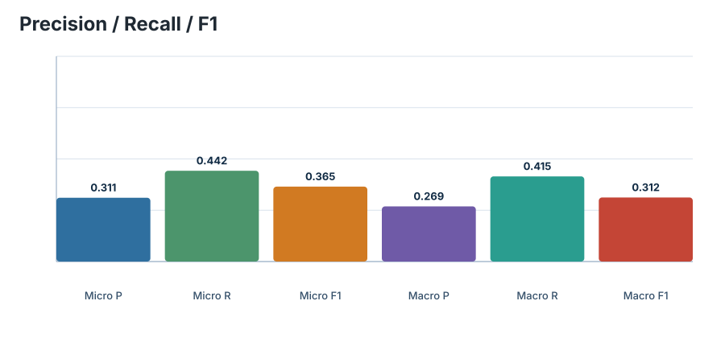
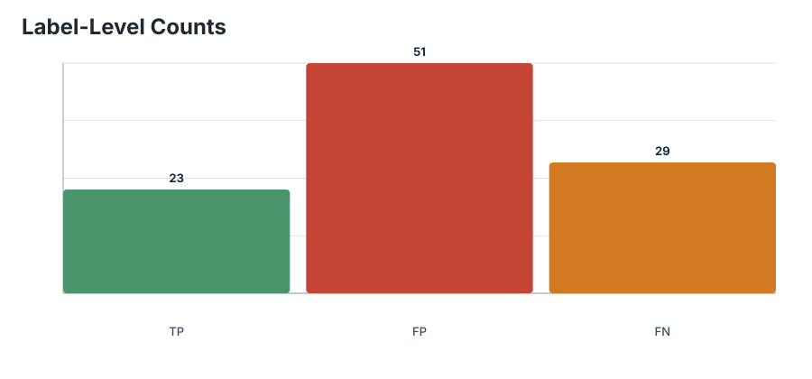
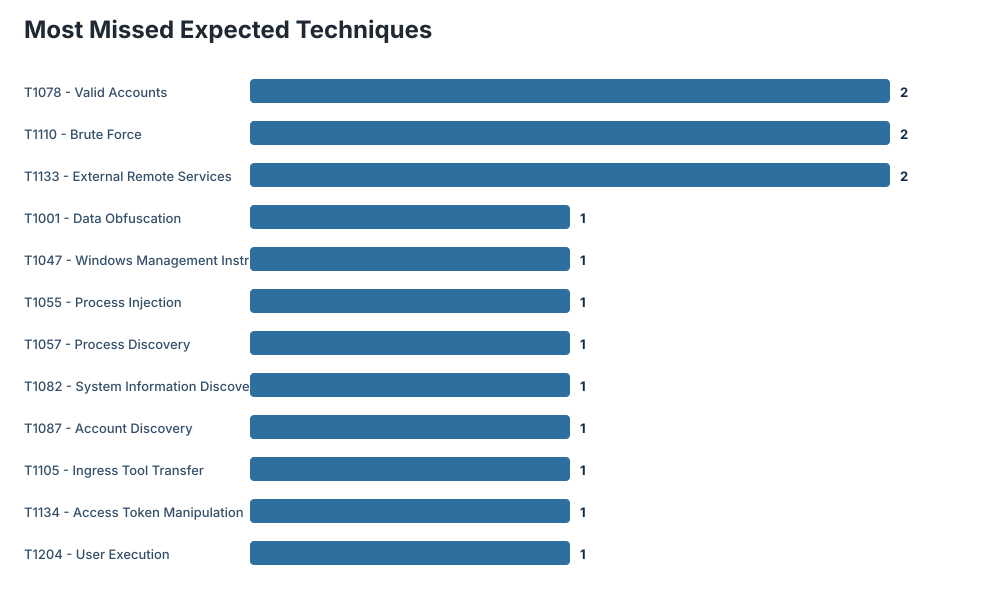
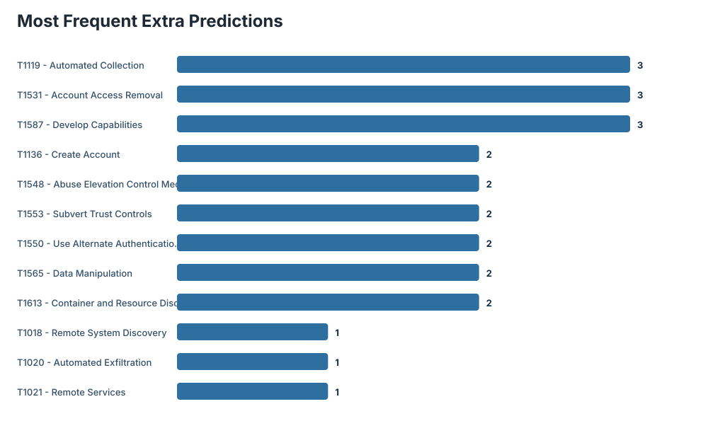
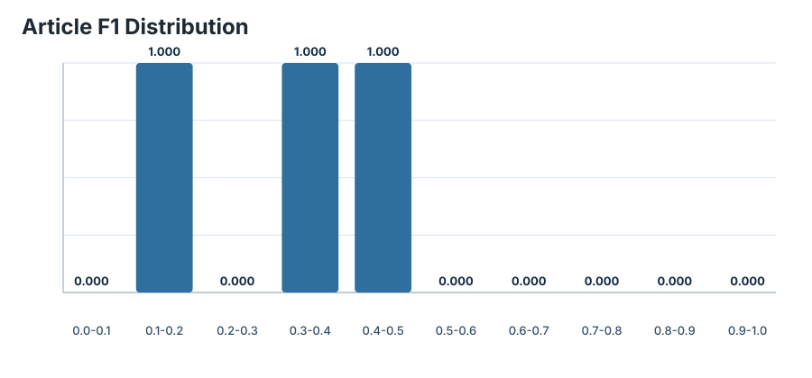

# CISA TTPXHunter Benchmark Report

## Run Configuration

| Field | Value |
| --- | --- |
| Dataset | `datasets/cisa/CISA-crawl-rt-ttp-ct.json` |
| Zenodo record | `14659512` |
| DOI | `10.5281/zenodo.14659512` |
| Articles evaluated | 3 / 77 |
| Text field | `clean` |
| Expected mode | `model-label-space` |
| Model | `nanda-rani/TTPXHunter` |
| Revision | `not pinned` |
| Threshold | 0.644 |
| Device | `cpu` |
| Batch size | 16 |

## Aggregate Metrics

| Metric | Value |
| --- | ---: |
| Expected labels | 52 |
| Predicted labels | 74 |
| True positives | 23 |
| False positives | 51 |
| False negatives | 29 |
| Micro precision | 0.310811 |
| Micro recall | 0.442308 |
| Micro F1 | 0.365079 |
| Macro precision | 0.268783 |
| Macro recall | 0.415007 |
| Macro F1 | 0.312103 |

## Charts

### Metrics overview

### TP / FP / FN counts

### Most missed expected techniques

### Most frequent extra predictions

### Article F1 distribution

## Article Quality

| Metric | Value |
| --- | ---: |
| Exact-match articles | 0 |
| Articles with no expected labels | 0 |
| Articles with no predictions | 0 |
| Mean expected labels/article | 17.333 |
| Median expected labels/article | 11.000 |
| Mean predicted labels/article | 24.667 |
| Median predicted labels/article | 21.000 |
| Mean sentences/article | 143.000 |
| Median sentences/article | 154.000 |

## Top Gaps

### Most Missed Expected Techniques

| Rank | Technique | Name | Count |
| ---: | --- | --- | ---: |
| 1 | `T1078` | Valid Accounts | 2 |
| 2 | `T1110` | Brute Force | 2 |
| 3 | `T1133` | External Remote Services | 2 |
| 4 | `T1001` | Data Obfuscation | 1 |
| 5 | `T1047` | Windows Management Instrumentation | 1 |
| 6 | `T1055` | Process Injection | 1 |
| 7 | `T1057` | Process Discovery | 1 |
| 8 | `T1082` | System Information Discovery | 1 |
| 9 | `T1087` | Account Discovery | 1 |
| 10 | `T1105` | Ingress Tool Transfer | 1 |
| 11 | `T1134` | Access Token Manipulation | 1 |
| 12 | `T1204` | User Execution | 1 |
| 13 | `T1555` | Credentials from Password Stores | 1 |
| 14 | `T1566` | Phishing | 1 |
| 15 | `T1585` | Establish Accounts | 1 |

### Most Frequent Extra Predictions

| Rank | Technique | Name | Count |
| ---: | --- | --- | ---: |
| 1 | `T1119` | Automated Collection | 3 |
| 2 | `T1531` | Account Access Removal | 3 |
| 3 | `T1587` | Develop Capabilities | 3 |
| 4 | `T1136` | Create Account | 2 |
| 5 | `T1548` | Abuse Elevation Control Mechanism | 2 |
| 6 | `T1553` | Subvert Trust Controls | 2 |
| 7 | `T1550` | Use Alternate Authentication Material | 2 |
| 8 | `T1565` | Data Manipulation | 2 |
| 9 | `T1613` | Container and Resource Discovery | 2 |
| 10 | `T1018` | Remote System Discovery | 1 |
| 11 | `T1020` | Automated Exfiltration | 1 |
| 12 | `T1021` | Remote Services | 1 |
| 13 | `T1029` | Scheduled Transfer | 1 |
| 14 | `T1104` | Multi-Stage Channels | 1 |
| 15 | `T1201` | Password Policy Discovery | 1 |

### Most Frequent Matches

| Rank | Technique | Name | Count |
| ---: | --- | --- | ---: |
| 1 | `T1083` | File and Directory Discovery | 2 |
| 2 | `T1003` | OS Credential Dumping | 1 |
| 3 | `T1027` | Obfuscated Files or Information | 1 |
| 4 | `T1048` | Exfiltration Over Alternative Protocol | 1 |
| 5 | `T1059` | Command and Scripting Interpreter | 1 |
| 6 | `T1071` | Application Layer Protocol | 1 |
| 7 | `T1106` | Native API | 1 |
| 8 | `T1140` | Deobfuscate/Decode Files or Information | 1 |
| 9 | `T1218` | System Binary Proxy Execution | 1 |
| 10 | `T1219` | Remote Access Software | 1 |
| 11 | `T1486` | Data Encrypted for Impact | 1 |
| 12 | `T1490` | Inhibit System Recovery | 1 |
| 13 | `T1547` | Boot or Logon Autostart Execution | 1 |
| 14 | `T1560` | Archive Collected Data | 1 |
| 15 | `T1562` | Impair Defenses | 1 |

## Article-Level Extremes

### Best Articles

| Rank | Index | F1 | Precision | Recall | TP | FP | FN | Expected | Predicted | URL |
| ---: | ---: | ---: | ---: | ---: | ---: | ---: | ---: | ---: | ---: | --- |
| 1 | 0 | 0.457143 | 0.457143 | 0.457143 | 16 | 19 | 19 | 35 | 35 | [open](https://www.cisa.gov/news-events/cybersecurity-advisories/aa24-060a) |
| 2 | 2 | 0.312500 | 0.238095 | 0.454545 | 5 | 16 | 6 | 11 | 21 | [open](https://www.cisa.gov/news-events/cybersecurity-advisories/aa24-046a) |
| 3 | 1 | 0.166667 | 0.111111 | 0.333333 | 2 | 16 | 4 | 6 | 18 | [open](https://www.cisa.gov/news-events/cybersecurity-advisories/aa24-057a) |

### Worst Articles

| Rank | Index | F1 | Precision | Recall | TP | FP | FN | Expected | Predicted | URL |
| ---: | ---: | ---: | ---: | ---: | ---: | ---: | ---: | ---: | ---: | --- |
| 1 | 1 | 0.166667 | 0.111111 | 0.333333 | 2 | 16 | 4 | 6 | 18 | [open](https://www.cisa.gov/news-events/cybersecurity-advisories/aa24-057a) |
| 2 | 2 | 0.312500 | 0.238095 | 0.454545 | 5 | 16 | 6 | 11 | 21 | [open](https://www.cisa.gov/news-events/cybersecurity-advisories/aa24-046a) |
| 3 | 0 | 0.457143 | 0.457143 | 0.457143 | 16 | 19 | 19 | 35 | 35 | [open](https://www.cisa.gov/news-events/cybersecurity-advisories/aa24-060a) |

## Output Artifacts

| Artifact | Path |
| --- | --- |
| json | `results/cisa/cisa_benchmark_limit3.json` |
| markdown_report | `results/cisa/cisa_benchmark_limit3_report.md` |
| rows_csv | `results/cisa/cisa_benchmark_limit3_rows.csv` |
| chart_metrics | `charts_limit3/metrics_overview.svg` |
| chart_confusion | `charts_limit3/confusion_counts.svg` |
| chart_top_missing | `charts_limit3/top_missing.svg` |
| chart_top_extra | `charts_limit3/top_extra.svg` |
| chart_f1_distribution | `charts_limit3/article_f1_distribution.svg` |

## Interpretation Notes

- The default benchmark compares base MITRE ATT&CK techniques only.
- CISA tactics are dropped, sub-techniques are collapsed to parent techniques, and invalid regex matches are ignored.
- `expected_mode=model-label-space` filters expected labels to techniques the TTPXHunter classifier can emit.
- High false positives indicate the threshold may need tuning for CISA advisories, which are longer and more operational than the SharpPanda sample.
