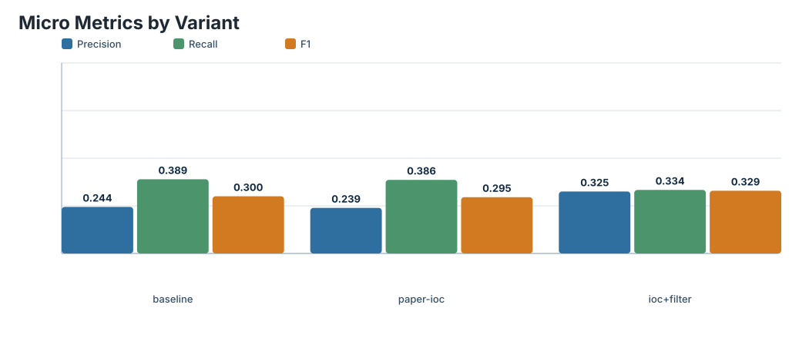
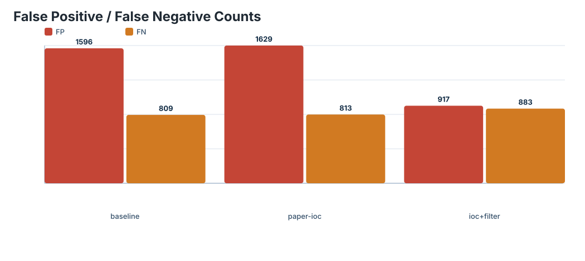
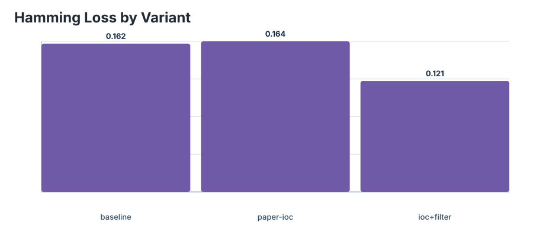
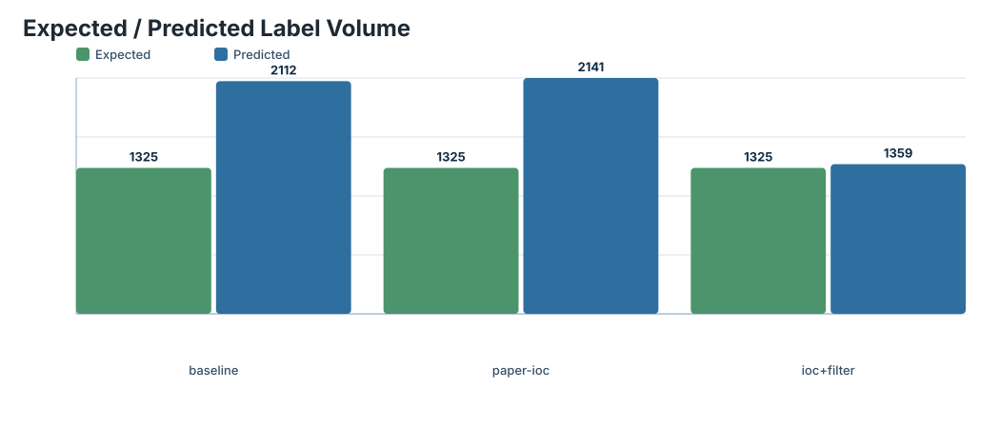

# CISA Gap Comparison

| Variant | Preprocess | Section filter | Model | Threshold | Top-k | Micro P | Micro R | Micro F1 | Label Macro F1 | Hamming Loss | Predicted | FP | FN |
| --- | --- | --- | --- | ---: | ---: | ---: | ---: | ---: | ---: | ---: | ---: | ---: | ---: |
| baseline | `none` | `none` | `nanda-rani/TTPXHunter` | 0.644 | none | 0.244318 | 0.389434 | 0.300262 | 0.221389 | 0.161833 | 2112 | 1596 | 809 |
| paper-ioc | `paper-ioc` | `none` | `nanda-rani/TTPXHunter` | 0.644 | none | 0.239141 | 0.386415 | 0.295441 | 0.218158 | 0.164323 | 2141 | 1629 | 813 |
| paper-ioc + CISA section filter | `paper-ioc` | `cisa-attack-narrative` | `nanda-rani/TTPXHunter` | 0.644 | none | 0.325239 | 0.333585 | 0.329359 | 0.231827 | 0.121122 | 1359 | 917 | 883 |

## Charts

### Micro precision / recall / F1

### False positives / false negatives

### Hamming loss

### Expected / predicted labels

## Interpretation

- CISA is used as an external robustness benchmark, not as the original paper benchmark.
- Improvements should be read as preprocessing, filtering, calibration, or retraining effects under domain shift.
- High false positives are expected when long advisory text contains non-attacker behavior because the classifier is closed-world.
